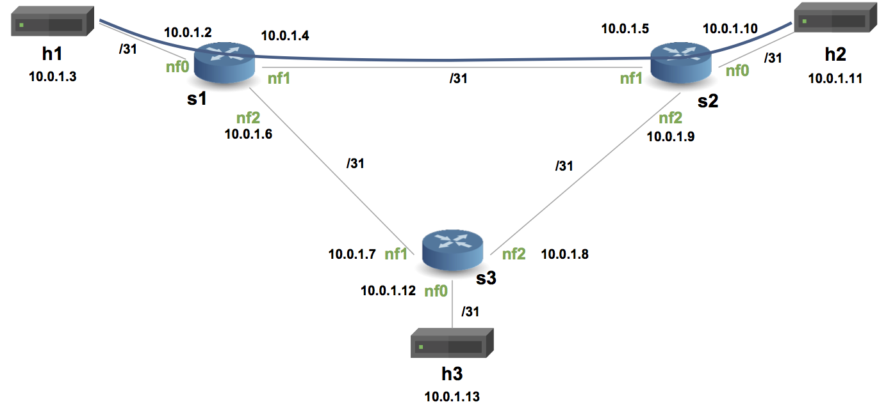

# Simple Router

You can use this directory to experiment with your router using bmv2 in Mininet.
Here's a quick overiew of how get going. You can find more info on the course website.

1. Write your P4 program
2. Create the topology JSON file
3. Update the variables in the Makefile to indicate your desired P4 program and topology
4. Fill out sX-commands.txt file(s), which can be used to populate any intial
   table entries. NOTE: these files use bmv2 commands, which is slightly different than
   the SimpleSumeSwitch commands
5. Compile P4 program and launch Mininet topology by running `$ make`
6. Note which thrift port each switch is running on. The initial port value
   is 9090 and it increments by 1 for each additional switch.
7. Note which switch interface is used for control traffic. It will always be of the
   form sX-eth1.
8. Start control-plane (in P4-NetFPGA-CS344 repo): For example,
  `# ./control_plane.py --mode bmv2 --thrift_port 9090 --iface s1-eth1 --config topos/single-router.json`
9. Open xterm on hosts:
  `mininet> xterm h1 h2`
10. Run tests

Here are images of the topologies described in the JSON files in this directory:

**Single Switch Topology**

**Triangle Topology**

